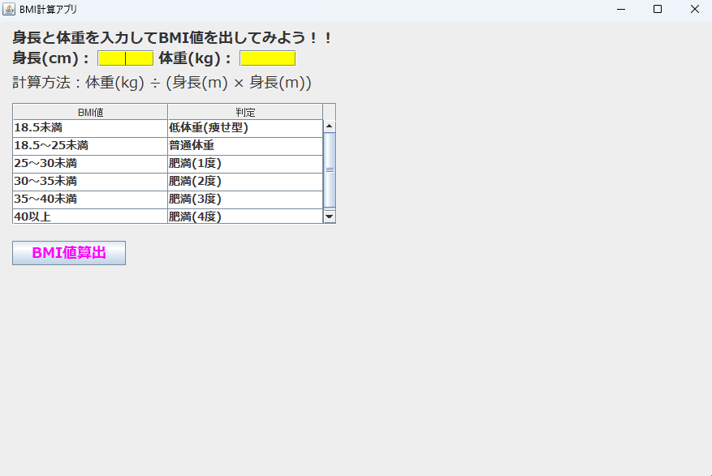

# BMI計算アプリ

Javaで作成したBMI計算アプリです。  
身長と体重を入力するとBMIを計算し、判定結果を表示します。

## アプリ画面

## 使用技術

・Java  
・Swing  
・JTable  

## 主な機能

・身長と体重を入力してBMIを計算  
・BMI判定結果の表示  
・BMI基準表の表示  
・適正体重範囲の表示  

## 工夫した点

JTableを使用してBMI判定表を表示しました。  
また入力値が不正な場合はエラー表示を行うようにしています。

## 学んだこと

・JavaでのGUI画面作成
・ActionListenerによるイベント処理
・JTableの使い方
・数値入力を受け取って計算結果を画面に反映する流れ
・例外処理（NumberFormatException）の基本

## 今後の改善案

・クラス分割によるコード整理
・変数名の改善
・レイアウトの見直し
・入力チェック機能の強化
